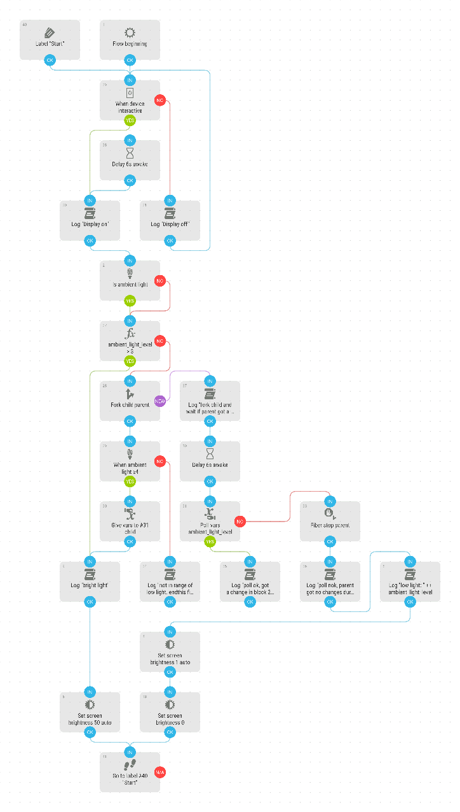

# Ambient Light Level
Sets the Display Brightness depending on the ambient light. ... yes, the phones usually do this automatically. But my Samsung Galaxy Note 8 has a bug: when unlocking with the home button in the night it sets the brightness to very bright. I even have to change the brightness levels two times to set it back to darker mode. And wait 7 seconds.

[Download flow](https://github.com/mgafner/automate-flows/blob/master/ambient_light_level.flo?raw=true)

## Flow Screenshot

