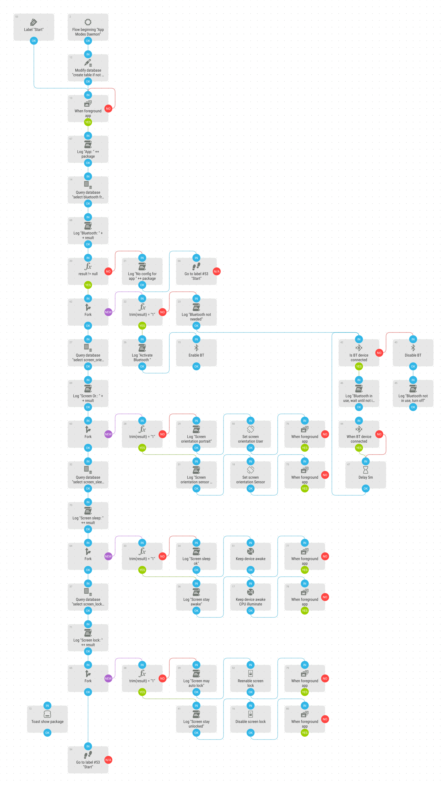

# Apps Modes Daemon
Set state of Bluetooth, Screen Sleep, Screen Lock and Screen Rotation for each app which is configured with the [Apps Modes Selector](apps_modes_selector.md).

[Download flow](https://github.com/mgafner/automate-flows/blob/master/apps_modes_daemon.flo?raw=true)

## Flow Screenshot

