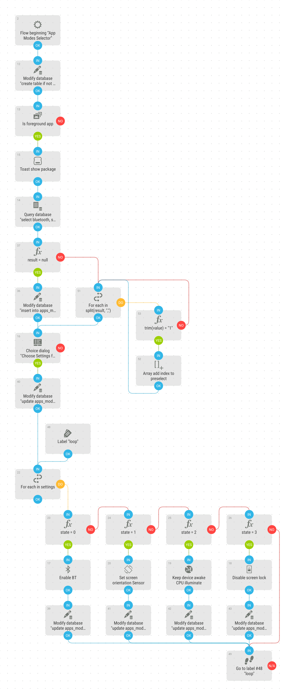

# Apps Modes Selector
Ask for states of Bluetooth, Screen Sleep, Screen Lock and Screen Rotation for the current app in foreground. Settings are then set by the [Apps Modes Daemon](apps_modes_daemon.md).

[Download flow](https://github.com/mgafner/automate-flows/blob/master/apps_modes_selector.flo?raw=true)

## Flow Screenshot

