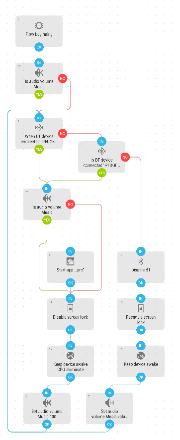

# Car Mode
This i was using when travelling every day with my car. It starts the App Locus Maps, sets the volume to 100% and sets the screen to stay awake.

[Download flow](https://github.com/mgafner/automate-flows/blob/master/car_mode.flo?raw=true)

## Flow Screenshot

