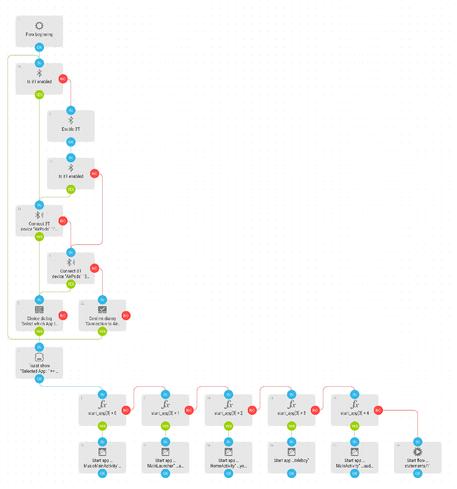

# Connect AirPods and start selected App
Starts Bluetooth, connects my AirPods and give me a choice of Apps to start.

[Download flow](https://github.com/mgafner/automate-flows/blob/master/connect_airpods_and_start_app.flo?raw=true)

## Flow Screenshot

