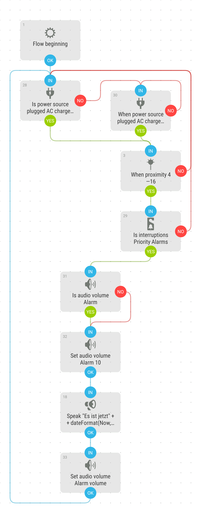

# Speak Time when waving
This tool speaks the time when you move your hand over the proximity sensor. It is activated when the phone charging and do not disturb mode is set to alarm only.

[Download flow](https://github.com/mgafner/automate-flows/blob/master/time_speaker_when_waving.flo?raw=true)

## Flow Screenshot

