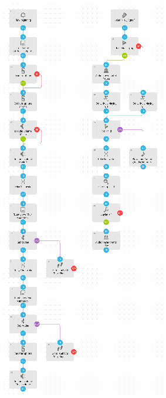

# Zen Meditation Timer
Timer for my zen meditation. Sets phone to "do not disturb" mode, sets audio volume to 7% and gives start and end signal. After meditation the modes and audio volumes are restored.

[Download flow](https://github.com/mgafner/automate-flows/blob/master/zen_meditation_reminder.flo?raw=true)

## Flow Screenshot

